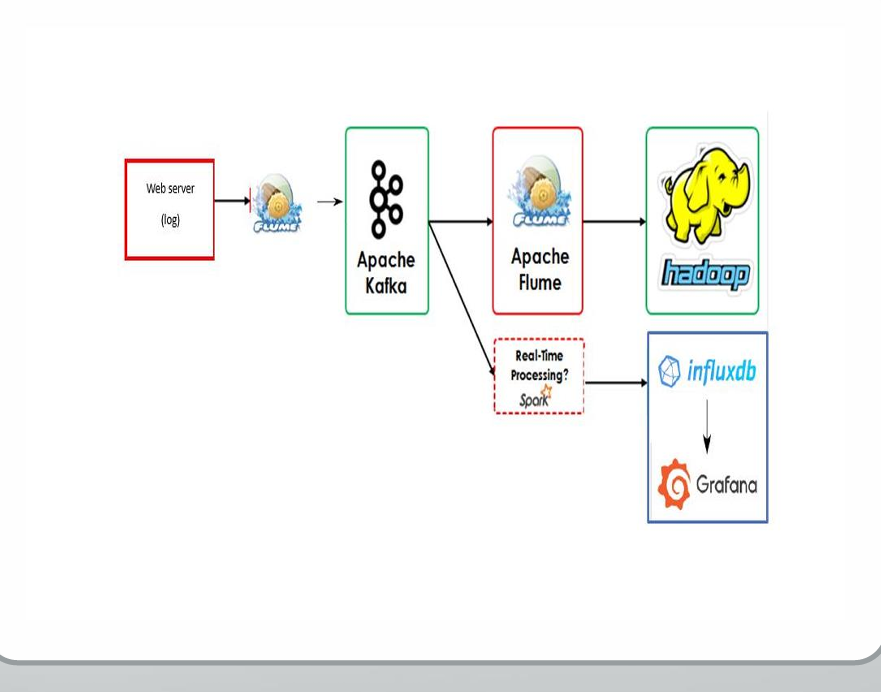

## Overview
This project demonstrates a data engineering pipeline designed on CentOS 6.5 with Hadoop and other Big Data tools. The pipeline pulls data from an external API, processes it in real-time, and stores it in a cloud database.

**Pipeline Summary:**
1. **Data Collection**: A Python script pulls user data from [RandomUser API](https://randomuser.me/api).
2. **Ingestion**: Apache Flume ingests the data and sends it to Apache Kafka.
4. **Storage & Processing**: Flume transfers a copy of the data from Kafka (as a consumer) to HDFS, while Spark processes data from Kafka (as a consumer) in real-time.
5. **Storage in Cloud**: Processed data is stored in InfluxDB on the cloud.
6. **Analysis & Visualization**:  Data is analyzed and visualized using Grafana Cloud, providing real-time insights and dashboards for monitoring user metrics and trends.

## Project Architecture
- **Python Script**: Fetches JSON data from RandomUser API and saves it to the local file system.
- **Apache Flume**: Captures JSON data from the file system, sends it to Kafka, and writes a copy to HDFS.
- **Apache Kafka**: Manages data streaming and messaging between producers and consumers.
- **Apache Spark**: Consumes data from Kafka for real-time processing.
- **InfluxDB**: Stores processed data for analytics and visualization on the cloud.
- **Grafana Cloud**:  Provides a platform for visualizing and analyzing data stored in InfluxDB, enabling the creation of interactive dashboards and reports to monitor user metrics and trends in real-time.


---

## Prerequisites

- **Virtual Machine**: CentOS 6.5 (or any compatible machine depending on your setup)
- **Hadoop**: For distributed storage
- **Apache Flume**: For data ingestion
- **Apache Kafka**: For data streaming
- **Apache Spark**: For real-time data processing
- **InfluxDB**: For cloud-based storage
- **Grafana Cloud**: For data visualization and analysis

Ensure all tools are properly installed and configured in your environment. Follow their official installation guides as necessary.

Adjust this project's files (Configurations & Python Scripts) to match your setup.

---

## Project Setup

### 1. Python Script for Data Collection
This script pulls user data from the RandomUser API and saves it to a specified local directory.

**`pop.py`**
```python
# pop.py
import requests
import time
import json
import os
from datetime import datetime

# Directory to save response files
output_dir = "/home/bigdata/Desktop/pop"  # Modify this to match your desired directory
os.makedirs(output_dir, exist_ok=True)  # Create directory if it doesn't exist

while True:
    try:
        # Connect to the API to get a response
        response = requests.get("https://datausa.io/api/data?drilldowns=Nation&measures=Population")
        if response.status_code == 200:
            fetched_data = response.json()

            # Create a unique filename based on the current timestamp
            timestamp = datetime.now().strftime("%Y%m%d_%H%M%S")
            filename = os.path.join(output_dir, f"response_{timestamp}.json")

            # Write the response to a separate file
            with open(filename, 'w') as json_file:
                json.dump(fetched_data, json_file, indent=None)  # Pretty print JSON

            print(f"Data logged to file: {filename}")
        else:
            print("Failed to fetch data from API")

    except Exception as e:
        print(f"An error occurred: {e}")

    time.sleep(1)  # Wait for 1 seconds before the next fetch 


```
### 2. Configure Flume

Set up Flume with two configurations:
- The first configuration will pull data from the file generated by the Python script and send it to Kafka.
- The second configuration will consume data from Kafka and store it in HDFS.

#### Configuration 1: File Source to Kafka Sink

This configuration reads from `JSON files` (the file generated by the Python script) and sends the data to a Kafka topic.

**File to Kafka `logtokafka.conf`:**
```properties
s# Name the components on this agent
a1.sources = r1
a1.sinks = k1
a1.channels = c1

# Describe/configure the source
a1.sources.r1.type = spooldir
a1.sources.r1.channels = c1

#Modify this to match your directory
a1.sources.r1.spoolDir = /home/bigdata/Desktop/pop

a1.sources.r1.fileHeader = true

a1.sinks.k1.channel = c1
a1.sinks.k1.type = org.apache.flume.sink.kafka.KafkaSink

#Modify this to match your topic name
a1.sinks.k1.kafka.topic = pop 

a1.sinks.k1.kafka.bootstrap.servers = localhost:9092
a1.sinks.k1.kafka.flumeBatchSize = 20
a1.sinks.k1.kafka.producer.acks = 1
a1.sinks.k1.kafka.producer.linger.ms = 1
a1.sinks.k1.kafka.producer.compression.type = snappy

# Use a channel which buffers events in memory
a1.channels.c1.type = memory
a1.channels.c1.capacity = 1000
a1.channels.c1.transactionCapacity = 1000

# Bind the source and sink to the channel
a1.sources.r1.channels = c1
a1.sinks.k1.channel = c1

```
#### Configuration 2: Kafka Source to HDFS Sink

This configuration reads data from the Kafka topic and writes it to HDFS.

**Kafka to HDFS `kafkatohdfs.conf`:**
```properties
# Name the components on this agent
# Name the components on this agent
a2.sources = r2
a2.sinks = k2
a2.channels = c2

# Describe/configure the source
a2.sources.r2.type = org.apache.flume.source.kafka.KafkaSource
a2.sources.r2.channels = c2
a2.sources.r2.batchSize = 5000
a2.sources.r2.batchDurationMillis = 2000
a2.sources.r2.kafka.bootstrap.servers = localhost:9092

#Modify this to match your topic name
a2.sources.r2.kafka.topics = pop

# Describe the sink
a2.sinks.k2.type = hdfs
a2.sinks.k2.channel = c2

#Modify this to match your desired HDFS directory
a2.sinks.k2.hdfs.path = /case_pop
a2.sinks.k2.hdfs.filePrefix = events-
a2.sinks.k2.hdfs.round = true
a2.sinks.k2.hdfs.roundValue = 10 
a2.sinks.k2.hdfs.roundUnit = minute

# Use a channel which buffers events in memory
a2.channels.c2.type = memory
a2.channels.c2.capacity = 5000
a2.channels.c2.transactionCapacity = 5000

# Bind the source and sink to the channel
a2.sources.r2.channels = c2
a2.sinks.k2.channel = c2

```
### 3. Configure Kafka
Set up Kafka to receive data from Flume.

- Create a new topic:
  ```bash
  kafka-topics.sh --create --topic <my-kafka-topic> --bootstrap-server localhost:9092
  ```
  **The project's topic name is `pop`**

  ```bash
  kafka-topics.sh --create --topic user_logs --bootstrap-server localhost:9092
  ```
### 4. Configure Spark
Use Spark to consume data from Kafka, process it, and send results to InfluxDB.

#### Spark Script
This Spark application reads data from Kafka, processes it, and writes it to InfluxDB.

***Make sure to replace placeholders such as `your-influxdb-url`, `your-org-id`, `your-bucket-name`, `precision`, `your-influxdb-token`***

**Spark Application `influx.py`:**
```python
import kafka
import requests
from pyspark.sql import SparkSession
from pyspark.sql.functions import col, from_json, explode
from pyspark.sql.types import StructType, StructField, StringType, IntegerType, ArrayType

# Initialize Spark session with Kafka support
spark = SparkSession.builder \
    .appName("Kafka-PySpark-Integration") \
    .config("spark.jars.packages", "org.apache.spark:spark-sql-kafka-0-10_2.12:3.0.1") \
    .getOrCreate()

# InfluxDB Configuration
influxdb_url = "https://us-east-1-1.aws.cloud2.influxdata.com/api/v2/write?org=61936fbb21363b48&bucket=case_study&precision=s"
influxdb_token = "wqMtYys22CDmZBNZ62qD-VGDP4R-z1IODYJBYRPzTWrDsTrCnsS5jPFJd03eY6Odn2FqCW_KhnC8oRyDPIQi_g=="

# Define Kafka Variables
kafka_bootstrap_servers = "localhost:9092"
kafka_topic = "pop"

# Initialize a set to track processed records
processed_records = set()

# Define schema based on the new JSON structure
schema = StructType([
    StructField("data", ArrayType(
        StructType([
            StructField("ID Nation", StringType(), True),
            StructField("Nation", StringType(), True),
            StructField("ID Year", IntegerType(), True),
            StructField("Year", StringType(), True),
            StructField("Population", IntegerType(), True),
            StructField("Slug Nation", StringType(), True)
        ])
    ), True),
    StructField("source", ArrayType(
        StructType([
            StructField("measures", ArrayType(StringType()), True),
            StructField("annotations", StructType([
                StructField("source_name", StringType(), True),
                StructField("source_description", StringType(), True),
                StructField("dataset_name", StringType(), True),
                StructField("dataset_link", StringType(), True),
                StructField("table_id", StringType(), True),
                StructField("topic", StringType(), True),
                StructField("subtopic", StringType(), True)
            ]), True),
            StructField("name", StringType(), True),
            StructField("substitutions", ArrayType(StringType()), True)
        ])
    ), True)
])

# Read data from Kafka
df = spark.readStream \
    .format("kafka") \
    .option("kafka.bootstrap.servers", kafka_bootstrap_servers) \
    .option("subscribe", kafka_topic) \
    .load()

# Cast binary data to string
value_df = df.selectExpr("CAST(value AS STRING)")

# Apply schema to parse JSON
structured_df = value_df.select(from_json(col("value"), schema).alias("parsed")).select("parsed.*")

# Flatten the data array
flattened_df = structured_df.select(
    col("data")
).withColumn("nation_data", explode(col("data")))  # Flatten the data array

# Extract fields from nation_data
final_df = flattened_df.select(
    col("nation_data.`ID Nation`").alias("ID_Nation"),
    col("nation_data.Nation"),
    col("nation_data.`ID Year`").alias("ID_Year"),
    col("nation_data.Year"),
    col("nation_data.Population"),
    col("nation_data.`Slug Nation`").alias("Slug_Nation")
)

# Function to write the data to InfluxDB
def write_to_influxdb(data):
    # Use Population as a unique identifier
    unique_id = f"{data.get('Year')}-{data.get('Population')}"
    if unique_id in processed_records:
        return  # Skip if already processed

    # After successfully writing, add the unique ID to the processed set
    processed_records.add(unique_id)

    # Measurement name
    measurement = "population_data"

    # Prepare field sets
    fields = [
        f"ID_Nation=\"{data['ID_Nation']}\"",
        f"Nation=\"{data['Nation']}\"",
        f"ID_Year={data['ID_Year']}",
        f"Year=\"{data['Year']}\"",
        f"Population={data['Population']}",
        f"Slug_Nation=\"{data['Slug_Nation']}\""
    ]

    fields_str = ','.join(fields)

    # Combine into line protocol format
    line_protocol_data = f"{measurement} {fields_str}"

    # Prepare headers
    headers = {
        "Authorization": f"Token {influxdb_token}",
        "Content-Type": "text/plain; charset=utf-8",
    }

    # Send the line protocol data to InfluxDB
    response = requests.post(influxdb_url, data=line_protocol_data, headers=headers)
    
    # Tracking the request result
    if response.status_code != 204:
        print(f"Error writing to InfluxDB: {response.text}")
    else:
        print('Done!')

# Function to process each batch of data
def process_batch(batch_df, batch_id):
    for row in batch_df.collect():
        # Convert row to dictionary
        data = row.asDict()
        # Write each record to InfluxDB
        write_to_influxdb(data)

# Process the streaming data
query = final_df.writeStream \
    .outputMode("append") \
    .foreachBatch(process_batch) \
    .start()

# Await termination
query.awaitTermination()

# Stop the Spark session
spark.stop()


```
### 5. Configure InfluxDB Cloud
Set up InfluxDB Cloud to store processed data from Spark. 
Follow the [InfluxDB installation guide](https://docs.influxdata.com/influxdb/cloud/get-started/setup/) to set up InfluxDB Cloud.

1. **Sign Up and Create a Bucket**: 
   - If you haven't already, sign up for an InfluxDB Cloud account at [InfluxDB Cloud](https://cloud2.influxdata.com/signup).
   - Once logged in, create a new bucket where you will store the processed data. 

2. **Retrieve Connection Details**: 
   - Go to your InfluxDB Cloud dashboard and navigate to the **Data** section to find your organization and bucket information.
   - Collect your **API Token**, **organization ID**, and **bucket name**, as you will need these for your Spark application.

3. **Configure Connection in Spark**: 
   Ensure your Spark application is configured to connect to InfluxDB Cloud by replacing the placeholders in your Spark script with your InfluxDB Cloud details:
   - `your-influxdb-url`: Use the InfluxDB Cloud API endpoint (e.g., `https://us-west-2-1.aws.cloud2.influxdata.com`).
   - `your_bucket-name`: The name of the bucket you created.
   - `your_org-id`: Your organization ID from InfluxDB Cloud.
   - `your_api_token`: The API token you generated.

### 6. Configure Grafana Cloud

1. **Sign Up and Create a Dashboard**: 
   - Sign up at [Grafana Cloud](https://grafana.com/products/cloud/) and create a new dashboard for visualizing data.

2. **Add InfluxDB Data Source**: 
   - In the dashboard, navigate to **Data Sources** and select **Add Data Source**. Choose **InfluxDB**.

3. **Configure InfluxDB Connection**: 
   - Fill in the connection details:
     - **URL**: Use your InfluxDB Cloud API endpoint.
     - **Database**: Enter your bucket name.
     - **Password**: Input your API token.
  
4. **Test Data Source**: 
   - Click **Save & Test** to ensure the connection is successful.

5. **Create Visualizations**: 
   - Add panels to your dashboard for various visualizations like time series graphs and tables, customizing queries and settings as needed.

6. **Set Up Alerts**: 
   - Optionally, configure alerts to notify you of significant data changes by enabling alerts in the panel settings and defining notification conditions.

---

## Usage

1. **Ensure all of the Prerequisites services working (HDFS, YARN, ZooKeeper, Kafka)**:
   - For HDFS & YARN:
     ```bash
     start-all.sh
     ```
   - For ZooKeeper & Kafka"
     ```bash
     cd $KAFKA_HOME
     ```
     ```bash
     bin/zookeeper-server-start.sh config/zookeeper.properties
     ```
     ```bash
     bin/kafka-server-start.sh config/server.properties
     ```
2. **Create Kafka Topic**:
     ```bash
     cd $KAFKA_HOME
     ```
     ```bash
     bin/kafka-topics.sh --create --bootstrap-server localhost:9092 --replication-factor 1 --partitions 1 --topic pop
     ```
3. **Put Flume config files in config directory**:
     ```bash
     cp /<your-path>/logkafka.conf $FLUME_HOME/conf
     ```
     ```bash
     cp /<your-path>/kafkahdfs.conf $FLUME_HOME/conf
     ```
4. **Run Both of Flume Agents**:
   ```bash
   $FLUME_HOME/bin/flume-ng agent --conf conf --conf-file $FLUME_HOME/conf/logkafka.conf --name a1 -Dflume.root.logger=DEBUG,console
   ```
   ```bash
   $FLUME_HOME/bin/flume-ng agent --conf conf --conf-file $FLUME_HOME/conf/kafkahdfs.conf --name a2 -Dflume.root.logger=DEBUG,console
   ```
5. **Run the Python script to fetch data**:
   ```bash
   python3 pop.py/<your-path>/c.py
   ```
6. **Submit the Spark job**:
   
   	**Note that you must have the needed packages to connect to Kafka from Spark.**
   
   	**You also must change the numbers in this command to match your versions of Kafka and Sprak**
   ```bash
   spark-submit --packages org.apache.spark:spark-sql-kafka-0-10_2.12:3.0.1 pyspark_influx.py 
   ```
6. **Verify data in InfluxDB Cloud**:
   
   Check your InfluxDB Cloud dashboard to ensure data is being written to your specified bucket.
   
 


---
## Data Analysis & Visualization with Grafana

To visualize and analyze the data ingested into InfluxDB Cloud, I utilized **Grafana**, a powerful open-source analytics and monitoring platform. Grafana allows for real-time monitoring and data visualization, making it an essential tool in my project. Below are key points about how I integrated Grafana into my project:

- **Data Visualization**: Grafana enables the creation of dynamic dashboards, where I can visualize time-series data collected from various sources. This helped in identifying trends, patterns, and anomalies within the data.

- **Integration with InfluxDB Cloud**: I configured Grafana to connect to my InfluxDB Cloud instance, allowing for seamless querying of data stored in the InfluxDB database. This integration facilitated real-time data analysis through Flux queries.

- **Custom Dashboards**: I created custom dashboards tailored to specific metrics relevant to my project. These dashboards include various visualizations such as graphs, tables, and gauges, providing a comprehensive view of the data.

- **Alerts and Notifications**: Grafana's alerting features enabled me to set up notifications based on certain thresholds, ensuring timely responses to significant changes in the data.

By leveraging Grafana, I was able to enhance the analytical capabilities of my project, making the data not only accessible but also actionable.

![Grafana Results]


---

## Project Status and Future Work

This project successfully establishes a real-time data pipeline using Flume, Kafka, Spark, and InfluxDB Cloud. The data flows seamlessly from data generation through processing and storage in the cloud.

### Future Enhancements

- **Data Processing Optimization**: Implement advanced data transformation techniques in Spark, such as structured streaming optimizations and partitioning strategies, to handle even larger datasets more efficiently.

- **Expanded Data Sources and Outputs**: 
   - Add new data sources or APIs to enrich the dataset.
   - Consider integrating additional output storage or analytics solutions, such as Elasticsearch, for more versatile data use cases.

---

## Acknowledgments

- [RandomUser API](https://randomuser.me/) for providing the data generation API.
- [Apache Flume](https://flume.apache.org/) for its data ingestion capabilities.
- [Apache Kafka](https://kafka.apache.org/) for managing data streaming.
- [Apache Spark](https://spark.apache.org/) for real-time data processing.
- [Apache Hadoop](https://hadoop.apache.org/) for distributed storage solutions.
- [InfluxDB Cloud](https://www.influxdata.com/products/influxdb-cloud/) for its powerful cloud-based data storage and processing tools.
- [Grafana](https://grafana.com/) for its exceptional data visualization and monitoring capabilities.

